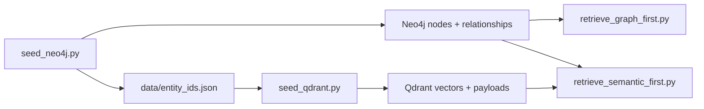
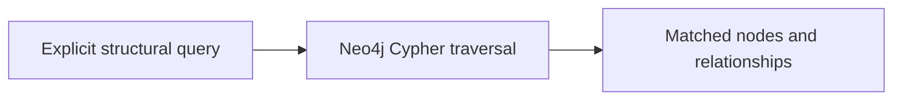
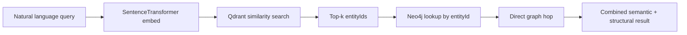

# Retrieval Flow

This document explains the runtime flow of the POC: how data is seeded, how the
graph and vector stores are connected, and how each retrieval path executes.

## Core idea

The repository validates a hybrid retrieval pattern built on two stores:

- **Neo4j** holds structure and relationships.
- **Qdrant** holds semantic vectors for the same entities.

The shared key is `entityId`.

Without that bridge, semantic hits cannot be turned back into graph traversal.

## Seed flow



### `seed_neo4j.py`

Creates the graph model:

- ValueStream
- Capability
- Domain
- Subdomain
- BoundedContext
- Component
- Contract

It also persists a stable `entityId` map to `data/entity_ids.json`.

### `seed_qdrant.py`

Embeds the same logical entities into Qdrant using `all-MiniLM-L6-v2`.

Each vector payload includes:

- `entityId`
- `name`
- `type`
- `text`

That payload is what allows a semantic hit to be resolved back to Neo4j.

## Retrieval paths

### Graph-first

`retrieve_graph_first.py` starts from structure.

Input shape:

- source node label
- relationship type
- target node label
- optional source node name filter

Execution path:



Best for questions like:

- what capabilities does Digital Sales invest in?
- what depends on auth-gateway?
- what contracts does a component expose?

### Semantic-first

`retrieve_semantic_first.py` starts from language.

Execution path:



Best for questions like:

- what handles an order?
- how does payment authorisation work?
- which services depend on each other?

## Why the `entityId` bridge matters

Qdrant alone can rank semantically relevant entities, but it does not know graph
structure.

Neo4j alone can traverse structure precisely, but it does not know which node a
free-text query was probably referring to.

`entityId` is the seam that lets the system do both:

1. find semantically relevant entities in Qdrant
2. resolve them exactly in Neo4j
3. traverse neighbors deterministically

That seam is the most important architecture decision validated by this repo.

## Verification path

The complete smoke test is:

```bash
python3 scripts/verify_stack.py
python3 scripts/seed_neo4j.py
python3 scripts/seed_qdrant.py
python3 scripts/retrieve_graph_first.py ValueStream INVESTS_IN Capability "Digital Sales"
python3 scripts/retrieve_semantic_first.py "what capabilities does Digital Sales invest in?" 5
```

The architecture is considered validated when:

- the graph seed completes
- the vector seed completes
- graph-first returns the expected structural edges
- semantic-first returns relevant entities and a valid graph hop