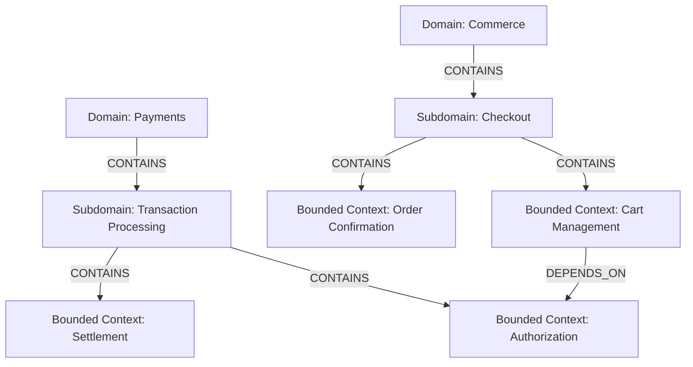
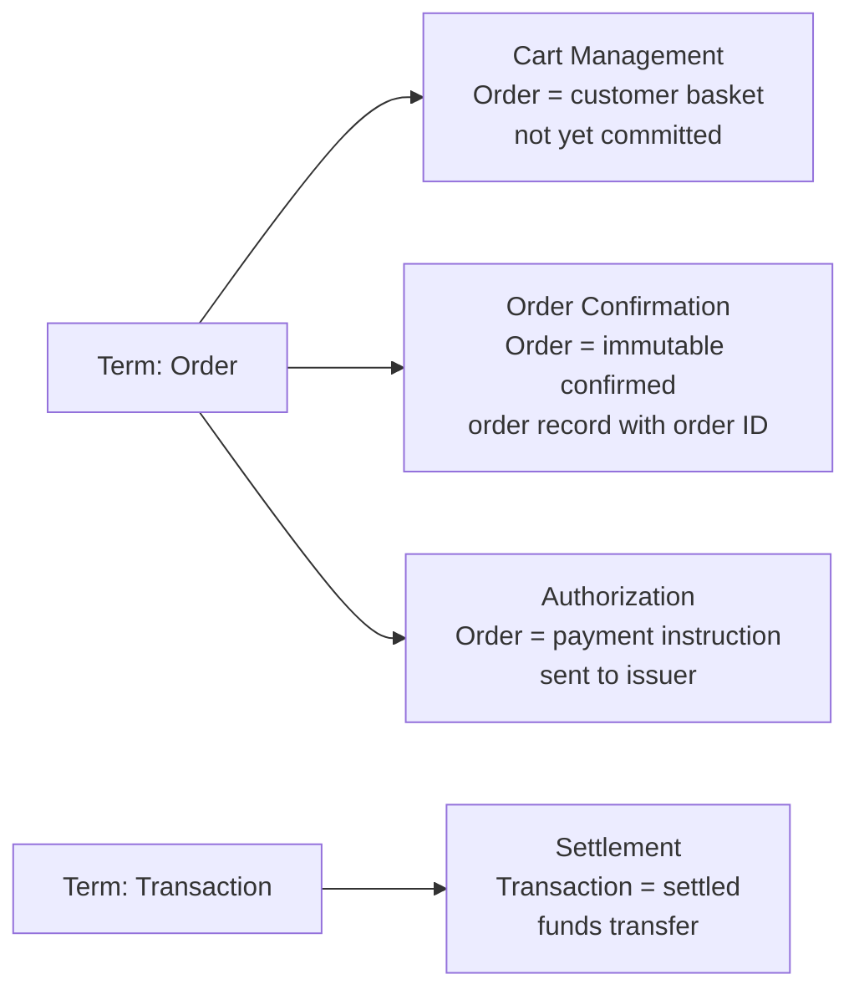

# Subdomains and Bounded Contexts

This diagram explains the domain model seeded by `scripts/seed_neo4j.py`, with focus on:

- Domain to subdomain boundaries
- Subdomain to bounded context boundaries
- Ubiquitous language differences across contexts

## Domain and Context Map

## Ubiquitous Language Map

## Why this matters for retrieval

- Graph-first retrieval can traverse exact boundaries using `CONTAINS` and `DEPENDS_ON`.
- Semantic-first retrieval can surface ambiguous terms like "Order" and then resolve meaning by bounded context.
- The same word can be valid in multiple contexts with different meanings, which is the key disambiguation test in this POC.
